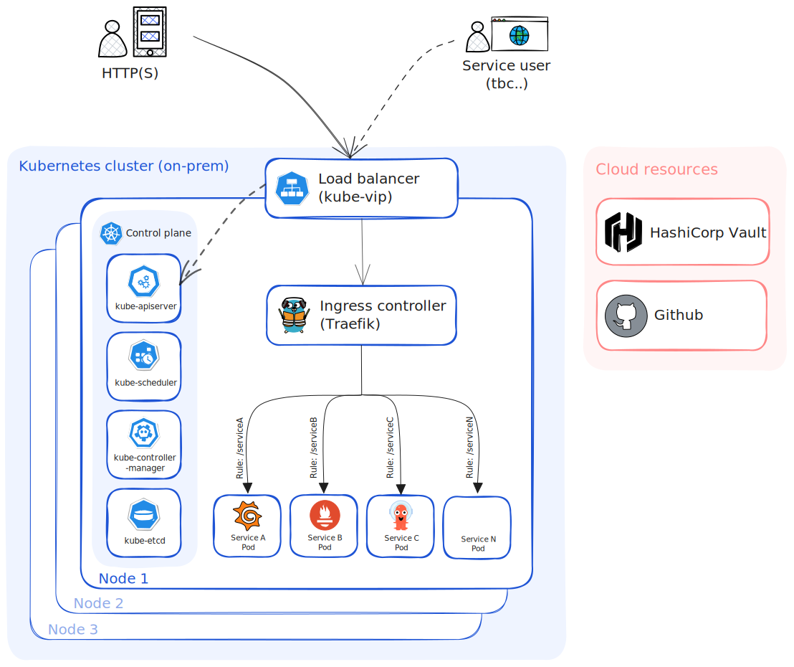

# 🏠 Homelab

**[Features](#features) • [Topology](#🌐-network-topology) • [Hardware](#⚙️-hardware)**

[](https://homelab.jordanhoare.com)
[](https://www.gnu.org/licenses/gpl-3.0.html)
[](https://github.com/jordanhoare/homelab)


<br>

## 📖 Overview

This project utilises [Infrastructure as Code](https://en.wikipedia.org/wiki/Infrastructure_as_code) and [GitOps](https://www.weave.works/technologies/gitops) to automate provisioning, operating, and updating self-hosted services in my homelab. This repo contains all assosiated configurations and documentation.

My homelab serves as a personal learning sandbox and a hub for new tech exploration. Meanwhile, self-hosting applications imbues a sense of ownership over the entire lifecycle of deploying and managing a stack of applications, from inception to operation. This process requires me to consider various critical aspects such as backup plans, security measures, scalability, and simplicity of deployment and upkeep.

<br>

## ⚙️ Hardware

- 2 × Lenovo `M910Q 7500T`:
    - CPU: `Intel Core i5-7500T processor @ 2.70GHz`
    - RAM: `8GB`
    - SSD: `256GB`
- 1 × 5 port switch `TP-Link LS105G`

<br>

## 🌐 Network topology

Here's a macroscopic overview of the state of my network, connecting all my devices together, including this lab.



<br>

## 🔧 Technology stack


<div class="d-flex">
<table class="table table-white table-borderer border-dark w-auto align-middle">
    <tr>
        <th></th>
        <th>Name</th>
        <th>Description</th>
    </tr>
    <tr>
        <td></td>
        <td><a href="https://www.ansible.com">Ansible</a></td>
        <td>Automate OS configuration, external services installation and k3s installation and bootstrapping</td>
    </tr>
    <tr>
        <td></td>
        <td><a href="https://argoproj.github.io/cd">ArgoCD</a></td>
        <td>GitOps tool for deploying applications to Kubernetes</td>
    </tr>
    <tr>
        <td></td>
        <td><a href="https://cloudinit.readthedocs.io/en/latest/">Cloud-init</a></td>
        <td>Automate OS initial installation</td>
    </tr>
    <tr>
        <td></td>
        <td><a href="https://ubuntu.com/">Ubuntu</a></td>
        <td>Cluster nodes OS</td>
    </tr>
    <tr>
        <td></td>
        <td><a href="https://k3s.io/">K3S</a></td>
        <td>Lightweight distribution of Kubernetes</td>
    </tr>
    <tr>
        <td></td>
        <td><a href="https://traefik.io/">Traefik</a></td>
        <td>Kubernetes Ingress Controller (alternative)</td>
    </tr>   
    <tr>
        <td></td>
        <td><a href="https://www.vaultproject.io/">Hashicorp Vault</a></td>
        <td>Secrets Management solution</td>
    </tr>
    <tr>
        <td></td>
        <td><a href="https://external-secrets.io/">External Secrets Operator</a></td>
        <td>Sync Kubernetes Secrets from Hashicorp Vault</td>
    </tr>
    <tr>
        <td></td>
        <td><a href="https://prometheus.io/">Prometheus</a></td>
        <td>Metrics monitoring and alerting</td>
    </tr>
    <tr>
        <td></td>
        <td><a href="https://grafana.com/oss/grafana/">Grafana</a></td>
        <td>Monitoring Dashboards</td>
    </tr>
</table>
</div>

<br>

## 💣 Teardown

- TBC

  ```bash
  kubectl ...
  ```
